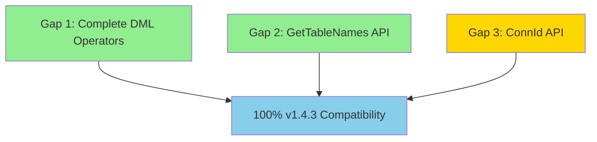

# Implementation Timeline: dukdb-go v1.4.3 Compatibility

Goal: Achieve 100% API compatibility with duckdb-go v1.4.3
Current Status: 95% compatible (17 of 20 features already implemented)
Remaining Work: 3 spectr proposals

---

## Dependency Analysis

Legend:
- 🟢 Green = Proposal created, graded, and fixed
- 🟡 Yellow = Proposal created, pending grading
- 🔵 Blue = Completion milestone

---

## Implementation Plan

### Phase 1: Core DML Operations (CRITICAL PATH) 🟢 DONE

Gap 1: Complete DML Operators
- Proposal: `spectr/changes/complete-dml-operators/`
- Status: ✅ Proposal created, graded (3 rounds), all issues fixed
- Priority: P0 - Critical
- Complexity: High (4-6 weeks implementation)
- Dependencies: None
- Blocks: None (can be implemented in parallel)
- Impact: Enables bulk INSERT, UPDATE, DELETE with WHERE clauses and DataChunk batching

Tasks (from proposal):
1. Executor WHERE clause integration
2. DataChunk batch processing (2048-row chunks)
3. WAL integration with group commit
4. Tombstone marking for DELETE
5. BeforeValues/AfterValues for UPDATE
6. Two-pass recovery for idempotence
7. Performance targets: 1M rows in <30s, memory <100MB

Test Coverage:
- 10+ unit tests
- 5 Phase D integration tests (currently skipped)
- Compatibility tests vs reference
- Performance benchmarks

---

### Phase 2: Query Introspection API 🟢 DONE

Gap 2: GetTableNames() Public API
- Proposal: `spectr/changes/add-gettablenames-api/`
- Status: ✅ Proposal created, graded (1 round), all 56 issues fixed
- Priority: P1 - Major
- Complexity: Medium (2-3 weeks implementation)
- Dependencies: None
- Blocks: None (can be implemented in parallel)
- Impact: Enables query analysis, dependency resolution, access control validation

Tasks (from proposal):
1. AST visitor pattern for table extraction
2. TableExtractor implementation
3. Qualified vs unqualified name modes (schema.table support in Phase 1)
4. Public GetTableNames() function
5. Deduplication and sorting
6. Handle JOINs, subqueries (CTEs deferred to Phase 2 due to AST limitations)

Test Coverage:
- 30+ unit tests (all JOIN types, subqueries, edge cases)
- 30+ compatibility tests vs reference (for supported features)
- Performance benchmarks (<500µs for simple queries)

Limitations Documented:
- CTEs NOT supported (requires AST enhancement)
- UNION/INTERSECT/EXCEPT NOT supported (requires AST enhancement)
- CREATE TABLE AS SELECT NOT supported (requires AST enhancement)
- UPDATE...FROM NOT supported (requires AST enhancement)

---

### Phase 3: Connection Tracking API 🟡 PENDING

Gap 3: ConnId() Public API
- Proposal: `spectr/changes/add-connid-api/`
- Status: ✅ Proposal created, validation passed
- Priority: P2 - Moderate
- Complexity: Low (1 week implementation)
- Dependencies: None
- Blocks: None (can be implemented in parallel)
- Impact: Enables connection pooling, debugging, per-connection state tracking

Tasks (from proposal):
1. Add global atomic counter (sync/atomic.Uint64)
2. Add ID field to backend Connection struct
3. Assign ID in NewConnection()
4. Add Connection.ID() method
5. Public ConnId() function using database/sql.Conn.Raw()
6. Error handling (nil, closed, wrong driver)

Test Coverage:
- 10+ unit tests (uniqueness, stability, thread-safety)
- Compatibility tests vs reference
- Performance: <100ns per call (negligible overhead)

---

## Parallel Work Opportunities

All 3 gaps can be implemented in parallel - no dependencies between them:

| Gap | Team Member | Duration | Can Start |
|-----|-------------|----------|-----------|
| Gap 1: DML Operators | Developer 1 | 4-6 weeks | Immediately |
| Gap 2: GetTableNames | Developer 2 | 2-3 weeks | Immediately |
| Gap 3: ConnId | Developer 3 | 1 week | Immediately |

Optimal Timeline: 4-6 weeks total (with 3 developers working in parallel)

Sequential Timeline: 7-10 weeks total (single developer, implementing in order)

---

## Testing Strategy

### Integration Testing (Sequential)
After each gap implementation:
1. Run full test suite: `nix develop -c gotestsum --format short-verbose ./...`
2. Run compatibility tests: `nix develop -c gotestsum ./compatibility/...`
3. Run linter: `nix develop -c golangci-lint run`
4. Run with race detector: `go test -race ./...`

### Final Validation (After All 3 Gaps)
1. Verify 100% v1.4.3 API signature match
2. Verify behavior matches reference for all test cases
3. Performance validation against targets
4. Zero regressions in existing test suite
5. Code coverage >90% on new code

---

## Risk Assessment

### Low Risk
- Gap 3 (ConnId): Simple atomic counter, minimal surface area
- Gap 2 (GetTableNames): Pure parsing logic, no storage/execution changes

### Medium Risk
- Gap 1 (DML Operators): Complex integration with executor, WAL, and storage
  - Mitigation: Comprehensive test coverage, incremental rollout
  - Mitigation: Two-pass WAL recovery for idempotence
  - Mitigation: Deterministic testing with quartz.Mock

### Mitigation Strategies
1. Incremental Implementation: Implement DML operators one at a time (INSERT → UPDATE → DELETE)
2. Feature Flags: Gate new DML functionality behind config flags during development
3. Extensive Testing: 50+ tests per gap minimum
4. Deterministic Testing: Use quartz.Mock for all async/timeout scenarios
5. Compatibility Validation: Compare against reference implementation at every step

---

## Success Criteria

### Individual Gap Completion
- [ ] Gap 1: All 5 Phase D tests passing, 1M rows in <30s, zero regressions
- [ ] Gap 2: All 30+ unit tests passing, compatibility tests passing, <500µs performance
- [ ] Gap 3: All 10+ unit tests passing, <100ns per call, compatibility match

### Overall Completion (100% v1.4.3 Compatibility)
- [ ] All 3 gaps implemented and tested
- [ ] Zero test regressions
- [ ] All compatibility tests passing
- [ ] Performance targets met
- [ ] Code coverage >90%
- [ ] Documentation complete
- [ ] CI pipeline green

---

## Timeline Estimate

| Milestone | Duration | Cumulative | Status |
|-----------|----------|------------|--------|
| Gap 1 Proposal | 1 day | Day 1 | ✅ DONE |
| Gap 1 Grading Round 1 | 0.5 days | Day 1.5 | ✅ DONE |
| Gap 1 Fixes Round 1 | 1 day | Day 2.5 | ✅ DONE |
| Gap 1 Grading Round 2 | 0.5 days | Day 3 | ✅ DONE |
| Gap 1 Fixes Round 2 | 1 day | Day 4 | ✅ DONE |
| Gap 1 Grading Round 3 | 0.5 days | Day 4.5 | ✅ DONE |
| Gap 2 Proposal | 1 day | Day 5.5 | ✅ DONE |
| Gap 2 Grading Round 1 | 0.5 days | Day 6 | ✅ DONE |
| Gap 2 Fixes Round 1 | 1 day | Day 7 | ✅ DONE |
| Gap 3 Proposal | 0.5 days | Day 7.5 | ✅ DONE |
| CURRENT STATUS | | Day 7.5 | 🎯 HERE |
| Gap 1 Implementation | 4-6 weeks | Week 7.5 | ⏳ READY |
| Gap 2 Implementation | 2-3 weeks | Week 7.5 (parallel) | ⏳ READY |
| Gap 3 Implementation | 1 week | Week 7.5 (parallel) | ⏳ READY |
| Final Integration Testing | 1 week | Week 8.5 | ⏳ PENDING |
| 100% Compatibility | | Week 8.5 | 🎯 TARGET |

Current Progress: 95% compatible, 3 proposals ready for implementation
Remaining Work: Implementation phase (4-6 weeks with parallel development)
Target Completion: Week 8.5 (optimistic with 3 developers in parallel)

